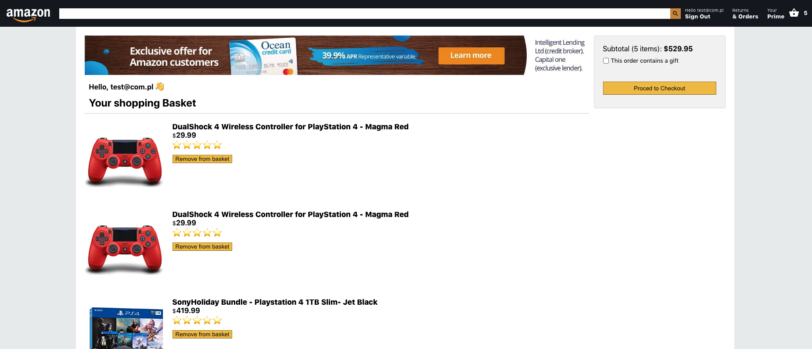

 

  

  <h1 align="center">Amazon Clone</h1>

  

    ..:: A very simplified Amazon clone, created with React,Firebase and Stripe payments ::..
     
     
    
     
    <a href="https://github.com/Elldrigar/amazon-clone/issues">Report Bug</a>
    ||
    <a href="https://github.com/Elldrigar/amazon-clone/issues">Request Feature</a>
  

![GitHub Release][github-url]
![MIT License][mit-license-image]
[![Twitter Follow][twitterbadge-url]][twitter-url]
[![LinkedIn][linkedin-shield]][linkedin-url]

 
<h2 align="center"> 🚧 Work in progress 🚧 </h2>
 

[github-url]: https://badgen.net/github/release/Elldrigar/amazon-clone?icon=github
[mit-license-image]: https://badgen.net/badge/license/MIT/blue
[twitterbadge-url]: https://badgen.net/twitter/follow/Elldrigar?icon=twitter
[twitter-url]: https://twitter.com/Elldrigar
[linkedin-shield]: https://img.shields.io/badge/-LinkedIn-black.svg?style=flat-square&logo=linkedin&colorB=555
[linkedin-url]: https://www.linkedin.com/in/artur-gawron-41bb40138/
